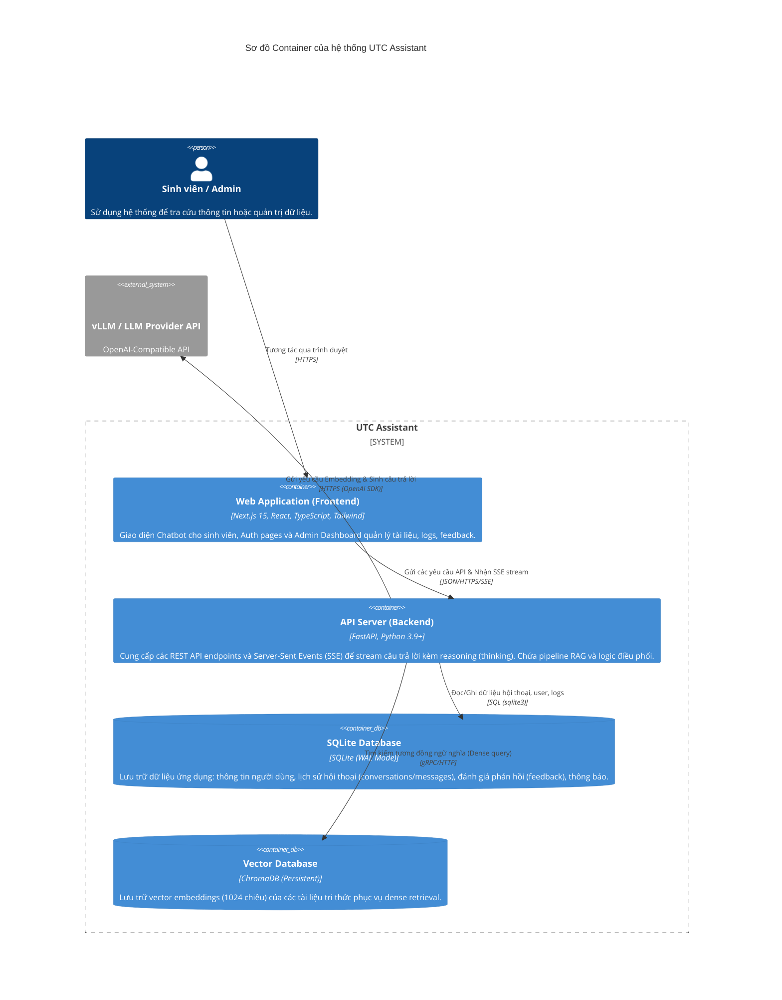
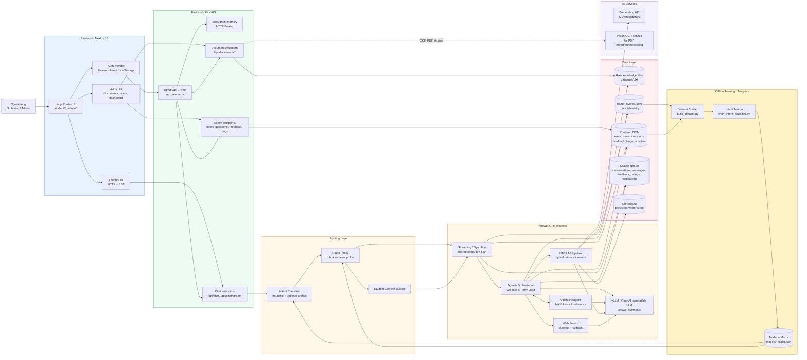
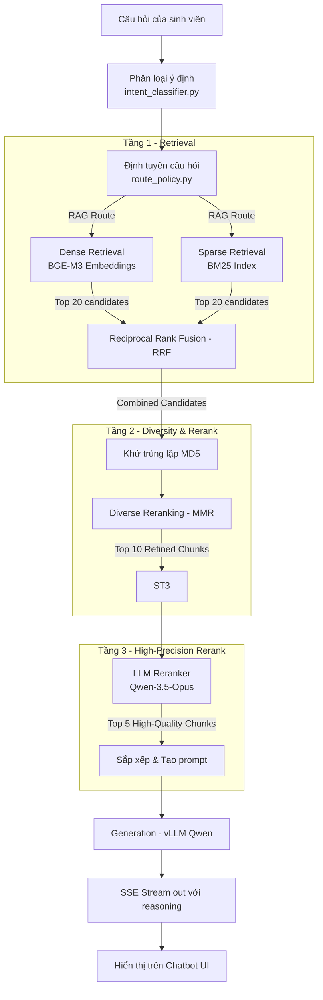
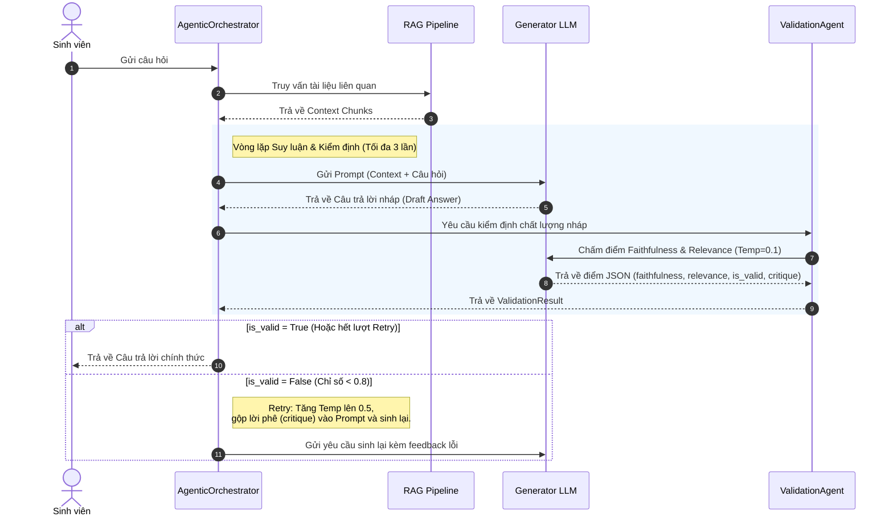

# Kiến trúc Hệ thống UTC Assistant

Tài liệu này mô tả kiến trúc tổng thể, mô hình container (C4 Container), cấu trúc thư mục repository và luồng dữ liệu của hệ thống **Trợ lý ảo hỗ trợ sinh viên Đại học Giao thông Vận tải (UTC Assistant)**.

---

## 1. Tổng quan Hệ thống

**UTC Assistant** là một hệ thống hỏi đáp thông minh hỗ trợ 24/7 dành cho sinh viên trường Đại học Giao thông Vận tải (UTC). Hệ thống sử dụng kỹ thuật **Truy vấn tạo sinh tăng cường (RAG - Retrieval-Augmented Generation)** để cung cấp câu trả lời chính xác, trung thực dựa trên cơ sở tri thức chính thống (Sổ tay sinh viên K66, FAQ, văn bản nhà trường).

Hệ thống bao gồm hai dự án chính:
*   **`utc-assistant`**: FastAPI Backend (Python), chịu trách nhiệm xử lý logic RAG, tìm kiếm hybrid, phân loại ý định, trích xuất dữ liệu OCR và cung cấp REST API/SSE stream.
*   **`utc-assistant-web`**: Next.js 15 App Router (TypeScript, Tailwind CSS), cung cấp giao diện người dùng trực quan cho Sinh viên (giao diện Chatbot) và Quản trị viên (Admin Dashboard).

---

## 2. Sơ đồ Kiến trúc Container (C4 Container Diagram)

Dưới đây là mô hình các container thành phần trong hệ thống và giao tiếp giữa chúng:



### 2.2 Sơ đồ Luồng xử lý chi tiết (Detailed Flow Diagram)

Sơ đồ chi tiết biểu diễn luồng dữ liệu và các liên kết từ giao diện người dùng, qua bộ định tuyến, cơ chế Agentic Orchestrator, bộ kiểm định ValidationAgent, tới các kho lưu trữ dữ liệu và dịch vụ AI nền tảng:



---

### 2.3 Sơ đồ Tiến trình xử lý câu hỏi nâng cao (Advanced Query Processing Diagram)

Sơ đồ dưới đây tập trung vào luồng xử lý nghiệp vụ của một câu hỏi gửi đến trợ lý ảo, mô tả trực quan các điểm quyết định (hình thoi), các điểm bắt đầu/kết thúc (hình tròn) và cơ chế sửa đổi câu trả lời thông qua Agentic Reasoning:

```mermaid
flowchart TD
    %% Node Definitions with shapes
    Start(("● Bắt đầu cuộc trò chuyện")) --> Input["Nhập câu hỏi của Sinh viên"]
    Input --> API["FastAPI Gateway / Auth Validation"]
    
    API --> Intent{"Ý định & Chủ đề?"}
    
    %% Intent paths
    Intent -->|"Ngoài phạm vi (Out of Domain)"| DirectFallback{"Có thuộc miền UTC?"}
    Intent -->|"Hỏi đáp nghiệp vụ"| RouteSelect{"Định tuyến nghiệp vụ"}
    Intent -->|"Cá nhân hóa (Điểm, GPA,...)"| StudentCtx["Trích xuất Hồ sơ Sinh viên"]
    
    StudentCtx --> RouteSelect
    
    DirectFallback -->|Không| OutAnswer["Trả lời: direct_fallback<br/>(Xin lỗi, tôi chưa có thông tin...)"]
    DirectFallback -->|Có| RouteSelect
    
    %% Routing and Retrieval
    RouteSelect -->|"RAG Pipeline"| Retrieve["Tìm kiếm Hybrid (BM25 + Dense BGE-M3)"]
    RouteSelect -->|"Web Search First"| WebQuery["Tìm kiếm Google (Bản quyền UTC)"]
    
    Retrieve --> RRF["Kết hợp thứ hạng (RRF Score)"]
    RRF --> MMR["Khử trùng lặp & Rerank đa dạng (MMR)"]
    MMR --> RerankLLM["Chấm điểm & Sắp xếp lại (LLM Reranker)"]
    
    %% Agentic Reasoning Loop
    RerankLLM --> GenDraft["Tạo câu trả lời nháp (Generator LLM)"]
    WebQuery --> GenDraft
    
    GenDraft --> Validate{"ValidationAgent đánh giá<br/>(Faithfulness & Relevance)"}
    
    %% Validation outcomes
    Validate -->| "Không đạt (< 0.8) " | RetryCount{"Đã thử lại 2 lần?"}
    Validate -->| "Đạt (>= 0.8) " | Finalize["Chuẩn hóa định dạng văn bản"]
    
    RetryCount -->|Chưa| Rewrite["Tăng Temp lên 0.5<br/>Nhúng critique sửa đổi"]
    Rewrite --> GenDraft
    
    RetryCount -->|Rồi| Finalize
    
    Finalize --> StreamOut(("● Trả kết quả SSE Stream"))
    OutAnswer --> StreamOut
    
    %% Database associations
    Retrieve -.-> Chroma[("ChromaDB<br/>(Dense Vectors)")]
    API -.-> SQLite[("SQLite app.db<br/>(Conversations & Users)")]
    StreamOut -.-> Logs[("Runtime logs & Telemetry<br/>(router_events.jsonl)")]

    %% Styling
    classDef startEnd fill:#f1f5f9,stroke:#64748b,stroke-width:2px,color:#334155;
    classDef process fill:#eff6ff,stroke:#3b82f6,stroke-width:2px,color:#1e40af;
    classDef decision fill:#fffbeb,stroke:#d97706,stroke-width:2px,color:#92400e;
    classDef db fill:#fff1f2,stroke:#f43f5e,stroke-width:2px,color:#9f1239;
    classDef action fill:#ecfdf5,stroke:#10b981,stroke-width:2px,color:#065f46;
    classDef fallback fill:#fef2f2,stroke:#ef4444,stroke-width:2px,color:#991b1b;
    
    class Start,StreamOut startEnd;
    class Input,API,StudentCtx,Retrieve,RRF,MMR,RerankLLM,GenDraft,Rewrite,Finalize process;
    class Intent,DirectFallback,RouteSelect,Validate,RetryCount decision;
    class Chroma,SQLite,Logs db;
    class WebQuery action;
    class OutAnswer fallback;
```

---


## 3. Cấu trúc Thư mục Repository

Cây thư mục tổng thể của dự án:

```text
mo_hinh_ngon_ngu_lon/
├── Bao_cao_MHNNL_UTC_Assistant.docx # Báo cáo môn học chi tiết
├── gen_report.py                    # Script tự động tạo báo cáo Word (.docx)
├── diagrams/                        # Chứa các sơ đồ kiến trúc nguồn (.mmd, .png)
├── utc-assistant/                   # [BACKEND PROJECT]
│   ├── src/                         # Mã nguồn ứng dụng Python
│   │   ├── api_server.py            # FastAPI entrypoint, routing & API endpoints
│   │   ├── rag_pipeline.py          # Pipeline RAG (Retrieve, Rerank, Generate)
│   │   ├── intent_classifier.py     # Phân loại ý định của người dùng (Heuristic + ML)
│   │   ├── route_policy.py          # Lớp quyết định định tuyến câu hỏi (Direct, RAG, Web)
│   │   ├── document_store.py        # Quản lý tài liệu nguồn và lập chỉ mục
│   │   ├── deep_reranker.py         # LLM Reranker chấm điểm mức độ liên quan
│   │   ├── chat_stream.py           # Quản lý luồng stream câu trả lời qua SSE
│   │   ├── chandra_ocr.py           # OCR tài liệu dạng ảnh quét bằng Vision LLM
│   │   ├── student_data.py          # Cá nhân hóa context dựa trên dữ liệu sinh viên
│   │   └── database.py              # Kết nối SQLite & định nghĩa Schema ORM
│   ├── data/                        # Dữ liệu của backend
│   │   ├── raw/                     # Tài liệu văn bản nguồn (.txt)
│   │   ├── vector_db/               # Cơ sở dữ liệu ChromaDB lưu trữ cục bộ
│   │   └── runtime/                 # SQLite DB (app.db) và tệp logs dạng JSON
│   ├── requirements.txt             # Các thư viện Python phụ thuộc
│   └── DESIGN.md                    # Hướng dẫn hệ thống thiết kế (Tokens, Colors)
│
└── utc-assistant-web/               # [FRONTEND PROJECT]
    ├── src/
    │   ├── app/                     # Next.js App Router
    │   │   ├── page.tsx             # Trang điều hướng chính
    │   │   ├── login/               # Đăng nhập
    │   │   ├── register/            # Đăng ký tài khoản
    │   │   ├── student/             # Giao diện Chatbot dành cho sinh viên
    │   │   └── admin/               # Admin Dashboard quản lý tài liệu, logs, feedback
    │   ├── components/              # Các UI Components dùng chung (Chat, Layout, UI Elements)
    │   └── lib/                     # Helper utilities, API client, local storage
    ├── tailwind.config.ts           # Cấu hình Tailwind CSS
    └── package.json                 # Cấu hình Node.js dependencies
```

---

## 4. Pipeline RAG 3 Tầng Chi Tiết (RAG Pipeline)

UTC Assistant áp dụng quy trình RAG 3 tầng tối ưu cho tiếng Việt để đảm bảo tìm đúng thông tin và tổng hợp câu trả lời chính xác:



### Chi tiết các tầng xử lý:
1.  **Tầng 1: Bi-encoder & BM25 Hybrid Retrieval**
    *   **Dense Search**: Mã hóa câu hỏi thành vector bằng mô hình đa ngôn ngữ `bge-m3` và truy vấn cosine similarity trên ChromaDB. Hỗ trợ Query Expansion (mở rộng câu hỏi) với bộ từ đồng nghĩa tiếng Việt 15 chủ đề.
    *   **Sparse Search**: Tìm kiếm từ khóa bằng thuật toán BM25 thuần Python (tốc độ cao).
    *   **RRF (Reciprocal Rank Fusion)**: Kết hợp xếp hạng của Dense và Sparse theo công thức: $RRF(d) = \sum_{r} \frac{1}{60 + rank_r(d)}$.
2.  **Tầng 2: MMR Diversity Rerank**
    *   Lọc bỏ các chunk bị trùng lặp nội dung qua mã băm MD5.
    *   Áp dụng **MMR (Maximal Marginal Relevance)** ($\lambda = 0.7$, Jaccard similarity) để loại bỏ các chunk có thông tin quá giống nhau, tăng độ phủ thông tin trong ngữ cảnh.
3.  **Tầng 3: LLM Reranker**
    *   Sử dụng mô hình ngôn ngữ lớn để chấm điểm độ liên quan (relevance score) từ 1 đến 10 của các chunk còn lại.
    *   Chuẩn hóa điểm số và lấy ra **Top-5** chunk có chất lượng cao nhất đưa vào prompt.
4.  **Bổ trợ nâng cao**:
    *   **Semantic Cache**: Bộ nhớ đệm LRU 50 truy vấn gần nhất với ngưỡng tương đồng Jaccard > 0.85 giúp phản hồi nhanh các câu hỏi trùng lặp mà không cần chạy lại toàn bộ pipeline RAG.
    *   **3-tier Fallback**: Định tuyến câu trả lời dựa trên chất lượng retrieval (Đủ kết quả $\rightarrow$ Một phần $\rightarrow$ Không tìm thấy).
    *   **Student Context Integration**: Tích hợp thông tin cá nhân của sinh viên (GPA, Tín chỉ, Cảnh báo đào tạo) từ cơ sở dữ liệu để chatbot đưa ra câu trả lời cá nhân hóa.

---

## 5. Cơ chế Agentic Reasoning (Vòng lặp Suy luận & Kiểm định)

Hệ thống áp dụng mô hình **Agentic Reasoning chuẩn mực** để giảm thiểu hiện tượng ảo giác (hallucination) và nâng cao chất lượng câu trả lời. Cơ chế này được xây dựng thông qua sự phối hợp giữa bộ điều phối độc lập ([AgenticOrchestrator](file:///Users/trantrung/CAOHOC_CNTT/mo_hinh_ngon_ngu_lon/utc-assistant/src/agentic_orchestrator.py)) và tác nhân kiểm định độc lập ([ValidationAgent](file:///Users/trantrung/CAOHOC_CNTT/mo_hinh_ngon_ngu_lon/utc-assistant/src/validation_agent.py)).



### Các thành phần chính trong vòng lặp:
1.  **Bộ điều phối ([AgenticOrchestrator](file:///Users/trantrung/CAOHOC_CNTT/mo_hinh_ngon_ngu_lon/utc-assistant/src/agentic_orchestrator.py))**:
    *   Nhận câu hỏi từ API server, thực hiện bước trích xuất Context từ RAG Pipeline.
    *   Điều khiển vòng lặp suy luận: Gọi LLM tạo câu trả lời nháp, sau đó gửi câu trả lời và context sang `ValidationAgent` để thẩm định.
    *   Hỗ trợ cơ chế **Retry tự động (tối đa 2 lần)**: Nếu câu trả lời nháp không đạt yêu cầu kiểm định, nó sẽ chuyển tiếp nhận xét phê bình (`critique`) của giám khảo vào lịch sử prompt và tăng nhiệt độ (`temperature`) của generator LLM từ `0.2` lên `0.5` để mô hình viết lại một cách sáng tạo và chính xác hơn.
2.  **Tác nhân kiểm định ([ValidationAgent](file:///Users/trantrung/CAOHOC_CNTT/mo_hinh_ngon_ngu_lon/utc-assistant/src/validation_agent.py))**:
    *   Được thiết kế độc lập, đóng vai trò giám khảo đánh giá câu trả lời dựa trên 2 chỉ số cốt lõi (từ 0.0 đến 1.0):
        *   **`faithfulness` (Tính trung thực)**: Câu trả lời có hoàn toàn dựa vào ngữ cảnh tài liệu hay có tự suy đoán/bịa đặt số liệu hay không?
        *   **`relevance` (Sự liên quan)**: Câu trả lời có trả lời đúng trọng tâm câu hỏi của sinh viên hay không?
    *   **Quy định duyệt**: Câu trả lời chỉ được thông qua (`is_valid: true`) khi cả hai chỉ số đều đạt tối thiểu **`0.8`**. Nếu dưới ngưỡng này, agent sẽ xuất ra trường `critique` phân tích rõ ràng lỗi sai (ví dụ: "chưa đề cập đến thời hạn", "bị sai số liệu học phí...") để cung cấp phản hồi tinh chỉnh cho bộ điều phối.

---

## 6. Điểm nổi bật trong Thiết kế và Vận hành

*   **Structure-aware Chunking**: Thay vì cắt nhỏ tài liệu theo số lượng từ cố định (dễ làm mất ngữ cảnh giữa câu), hệ thống phân tích mục lục của Sổ tay sinh viên và cắt nhỏ theo các đơn vị có ý nghĩa như Điều (Article), Mục (Section), giữ nguyên tiêu đề và đường dẫn phân cấp (breadcrumb) làm metadata.
*   **Reasoning (Thinking) Streaming**: Hỗ trợ hiển thị trực quan quá trình lập luận của mô hình ngôn ngữ lớn trên giao diện thông qua luồng Server-Sent Events (SSE). Mô hình suy nghĩ bằng tiếng Việt trong thẻ `<think>` và giao diện hiển thị trạng thái animate pulse mượt mà trước khi in ra câu trả lời chính thức.
*   **Design Tokens đồng nhất**: Hệ thống sử dụng bảng màu HSL và Slate Neutral tối giản, nhấn bằng màu Blue primary và Teal accent, được định nghĩa tập trung tại `design-tokens.json` và đồng bộ trong `Tailwind CSS` để mang lại giao diện tinh tế, hiện đại cho dashboard vận hành và khung chat.

